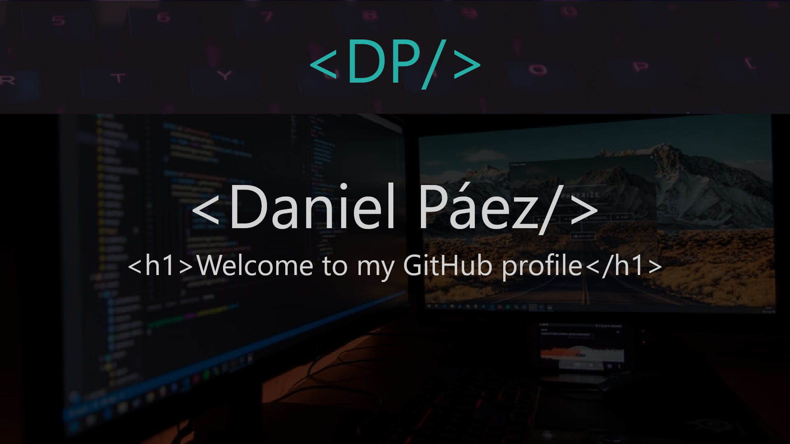

<h1 align='center'>
    
</h1>

 I'm Daniel Páez, I'm from Colombia, I'm 25 years old and I'm Electronic Engineer and Software Development Technician, 
     I like to learn every day new technologies and new forms to do something, I am passionate about programming 
     and writing code.

<h2 align='center'>My skills :computer:</h2>
<!-- Habilities shields -->

  <a href="#">
     <!--Shield HTML5 porcent-->
  </a>
  <a href="#">
     <!--Shield CSS3 porcent-->
  </a>
  <a href="#">
     <!--Shield SQL porcent-->
  </a>
  <a href="#">
     <!--Shield PYTHON porcent-->
  </a>
  <a href="#">
     <!--Shield C++ porcent-->
  </a>
    <a href="#">
     <!--Shield C++ porcent-->
  </a>
   </a>
    <a href="#">
     <!--Shield Electronic porcent-->
  </a>
   </a>
    <a href="#">
     <!--Shield React porcent-->
  </a>
   </a>
    <a href="#">
     <!--Shield .NET porcent-->
  </a>
    </a>
    <a href="#">
     <!--Shield Django porcent-->
  </a>

